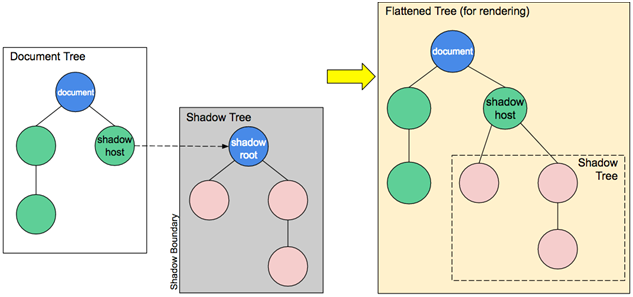
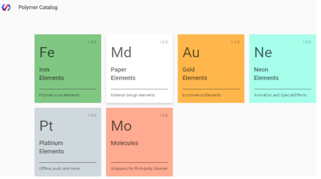

# Web components #  

The web is constantly evolving. Technologies were invented and implemented based on the needs that were relevant at the time of creation. Ten years ago, it was impossible to do what we are implementing now, and it is difficult to imagine what will happen in another 10 years. Business requires the creation of large and complex web software products with rich functionality, beauty, high performance. Often, to reduce the complexity of a product, it is divided into many simpler parts. Such a component approach improves the structure, understanding, increases the effectiveness of teamwork.

You can use web components for this.

__Web components__ - a set of standards that allows you to create new, custom HTML elements with their own properties, methods, encapsulated DOM and styles, without connecting any libraries or frameworks.

The basic approach for implementing a web component usually looks something like this:  

1. Create a class or function in which you specify the functionality of your web component. 

2. Register a new user-defined element using the CustomElementRegistry.define() method.

3. Attach the shadow DOM to the user element using the Element.attachShadow () method. Add children, event listeners, etc. to the shadow DOM using regular DOM methods.

4. Define the HTML template using "template" and "slot". Use the usual DOM methods again to clone the template and attach it to the shadow DOM.

5. Use your custom element on your page, wherever you are,  just like any other HTML element. 

Briefly, at the heart of any web component are four unique W3C technologies:  

+ __Custom elements__ 

+ __Shadow DOM__ 

+ __Import HTML__ 

+ __HTML templates__

Custom elements and the Shadow DOM eliminate the need for a separate tree and its crawl system. Together, they allow the developer to take their components outside as full participants in the action within the framework of the existing agreement, while hiding implementation details from accidental bypass and interference. Built-in elements (like "video" or "select") have always owned this trick, but so far it has not been available to simple developers.  

### Custom element ###

One of the key features of the web component standard is the ability to create custom elements on an HTML page that encapsulate functionality. We can create custom HTML elements described by our class with our methods and properties, events, and so on.

__Custom elements:__  - a set of JavaScript APIs that allow you to define user elements and their behavior, which you can then use as you wish in your user interface.

There are two kinds of custom elements:

+	_Autonomous user elements_ - are independent- they do not inherit embedded HTML elements. They are used on the page just like a regular HTML element. For example, document.createElement ("popup-info").

+	_Modified inline elements_ inherit basic HTML elements.

This is done by creating a class with special methods.

##### Using lifecycle callbacks #####

You can define several different callbacks in the custom elements constructor that will work at different stages of the element's life cycle:

    class MyElement extends HTMLElement {
    constructor () {super (); / * ... * /}
    connectedCallback () {/* browser calls this method when adding an element to the document; can be called many times if an item is repeatedly added / deleted * /}
    disconnectedCallback () {/ * browser calls this method when removing an element from the document; can be called many times if an item is repeatedly added / deleted * /}
    static get observedAttributes () {return [/ * an array of attribute names to track their changes * /]; }
    attributeChangedCallback (name, oldValue, newValue) {/ * is called when one of the above attributes is changed * /}
    adoptedCallback () {/ * is called when an item is moved to a new document; happens in document.adoptNode * /}
    // the element may have other methods and properties
    }
    After that, we need to register the element:
    // let the browser know that <my-element> is being served by our new class
    customElements.define ('my-element', MyElement); >
    /* <my-element> */  

We can extend and modify embedded HTML elements by inheriting their classes.  

### Shadow Dom ###

__Shadow DOM:__ - a set of JavaScript APIs for attaching an encapsulated "shadow" DOM tree to an element that is displayed separately from the main DOM document and controlling the corresponding functions. Thus, you can keep element elements in secret so that they can be created according to scripts and styles, without fear of collision with other parts of the document.

An important aspect of web components is encapsulation - the ability to keep the layout, style and behavior of markup hidden and separate from other code on the page so that different parts do not conflict, and the code can be kept clean and tidy. The Shadow DOM API is a key part of this, providing a way to attach a hidden detached DOM to an element.

Thanks to the Shadow DOM, the component has its own “shadow” DOM tree, which cannot be accessed from the main document just like that, it can have isolated CSS rules, etc.

The Shadow DOM allows hidden DOM trees to join elements in a regular DOM tree - this shadow DOM tree starts with a shadow root, under which you can attach any elements you want, just like a regular DOM.
  

There are some bits of shadow DOM terminology to be aware of:

+ __Shadow host__ the regular DOM node that the shadow DOM is attached to.

+ __Shadow tree__ the DOM tree inside the shadow DOM.

+ __Shadow bounder__ the place where the shadow DOM ends and the regular DOM begins. 

+ __Shadow root__ the root node of the shadow tree.

Each DOM element can have 2 types of DOM subtrees:

+ __Light tree__ – normal DOM subtree, consisting of HTML descendants. "Light" DOM subtree consisting of HTML descendants.

+ __Shadow tree__ -  “shadow”, DOM subtree, not reflected in HTML, hidden from prying eyes.

__Shadow DOM Elements:__

1. Have their own scope for identifiers

2. Invisible JavaScript selectors from the main document, such as querySelector,

3. Stylized by their styles from a shade tree, not from the main document.

The shadow DOM, if any, is rendered by the browser instead of the usual descendants (light DOM).

### Import HTML ###

The ability to import HTML code and reuse components on other pages.

### Template element ###

__HTML templates:__ "template" and "slot" elements allow you to write layouts for templates that do not appear in the displayed page. Then they can be reused as the basis of the structure of the user element.

When you have to reuse the same markup structures on a web page, it makes sense to use some kind of template. This was possible earlier, but it became easier thanks to the <template> HTML element in modern browsers. This element and its contents are not displayed in the DOM, but it can still be referenced using JavaScript.

Templates are useful in their own right, but they work even better with web components.

Reasons for the uniqueness of the <template> element:

+ The browser checks the correctness of the HTML syntax in it

+ Allows you to use any HTML tags, even those that are not used without the appropriate wrapper (for example, <tr>).

+ Its contents come to life when placed in a document.

+ The <template> element does not support iteration, data binding, or variable substitution. However, these features can be implemented on top of it.  

### Shadow DOM Slots. Composition. ###

Everything is fine, but the element is not very flexible. We can display only one bit of text inside. It is possible to display different text in each instance of an element in a good declarative way using the <slot> element.

Slots are identified by their name attribute and allow you to define placeholders in your template that can be filled with any fragment of the markup that you want.

__Slots__ - the ability to combine external html content with the internal html component

There are two types of slots:

1. _Named slots:_ 'slot name = "X"' ... '/slot' - receive light DOM elements with slot = "X".

2. _Default slot:_ the first 'slot' without a name (subsequent unnamed slots are ignored) - shows elements of light tree elements that are not in other slots.  

If multiple elements are assigned to one slot, they are added one after another.
The content of the 'slot' element is used as backup. It is displayed if there are no light wood elements in the slot.

The process of displaying elements within a slot is called a “composition”. As a result of the composition, an “expanded DOM” is built.

When compositing, nodes do not move - from the point of view of JavaScript. We can find out what elements are in the slot, and, conversely, determine the slot by the element that is in it:

1. _node.assignedSlot_ - returns the 'slot' element in which the node is located.

2. _slot.assignedNodes_ ({flatten: true / false}) - DOM nodes that are in the slot. The flatten option has a default value of false. If you explicitly change the value to true, it looks deeper into the expanded DOM and returns nested slots if there are nested components, and backup content if there are no nodes in the slot.

3. _slot.assignedElements_ ({flatten: true / false}) - DOM elements that are in the slot (the same as above, but only element nodes).  

These methods can be used not only to display content that is in the slots, but also to track it in JavaScript.

### Shadow DOM styles ###

The shadow DOM may contain "style" and "link rel = "stylesheet" href = "..."" tags. In the latter case, the style sheets are cached using the HTTP protocol, so that they will not be reloaded when using the same template for many components.

As a rule, local styles only work inside the shadow DOM, and document styles outside of it.

+ __:host__ - the: host selector allows you to select a host element (an element containing a shadow tree).

+ __:host (selector)__ - same as: host, but only applies if the host element matches the selector selector.

+ __:host-context (selector)__ - the same as: host, but only applies if the host element or any of its ancestors in the external document matches the selector selector.  

Slot elements come from a light DOM, so they use document styles. Local styles do not affect the contents of the slots.

### Advantages ###

+ _code reusability._

+ _user interface consistency._

+ _the ability to quickly develop programs._

+ _implementation of micro-frontends._

+ _allows you to create areas of isolated CSS._  

It is the components that allow programmers to make the final product from the "bricks", without going into the details of the implementation of a particular component. Components make code reuse completely natural.

If during the development of the system all programmers of the team use the same set of visual components, then, of course, the interface of the program will be made in the same style. And changing, for example, the appearance of one of the components, we will change its appearance wherever it is used.

Components enable independent development of portions of the interface. Changes within the component do not affect the code of the modules in which it is used. The properties of the components allow you to most effectively explain to another programmer how to use the component. Special property editors allow you to quickly customize the appearance and behavior of components.

Having accumulated a sufficient number of components, you can quickly create a visual interface for the program, without actually writing a single line of code. 

Independent widgets are rendered on the page, which can be written on completely different frameworks and different teams, but they need to somehow get along together. At the same time, they dump their CSS into a global area and interfere with each other in every way. To combat this, we previously had only iframes, but now we can wrap individual micro-fronts in the Shadow DOM so that they live their lives there.

It can take a lot of CSS to style large html pages, and it can be difficult for classes to come up with unique names. Shadow DOM comes to the rescue here. This technology allows you to create areas of isolated CSS. Thus, you can render a component with its own styles, which will not intersect with other styles on the page. Even if you have a class name that matches something else, the styles will not mix if each of them lives in its own Shadow DOM.  

### Disadvantages ###

Using the ability to flexibly control the behavior of components with the help of events provokes the writing of "event-oriented" code, and the departure from the object-oriented approach.

Global component names - each component instance gets its own copy of CSS, which should affect performance. Each web component is attached to its name. The problem is that the component names are declared globally.
The problem of the global register is the lack of a clear link between the place of registration of the component and its use. The absence of an explicit connection between import and use does not allow tree-shaking of your code - automatic removal of unused imports.

Typing issues - Javascript is a dynamic language, and not everyone likes it. In large projects, developers prefer typing. These technologies integrate perfectly with modern frameworks like React, checking the correct call of components.

Group update of properties - native browser components 'input' or "button", take values in the form of text attributes. However, sometimes it may be necessary to transfer more complex data to our components, objects. To do this, it is proposed to use properties with getters and setters. On the component side, we define a setter that will process this data. But if we need to update several properties at once, . As a result, we will have two extra updates.

# Polymer Library #

__The Polymer project consists of:__

+ __Polymer library:__ Polymer is a lightweight library that helps you take full advantage of Web Components. With Web Components, you can create reusable custom elements that interoperate seamlessly with the browser’s built-in elements, or break your app up into right-sized components, making your code cleaner and less expensive to maintain.

+ __WebComponents Polyfill:__ WebComponents Polyfill is a future targeted library aimed at fulfilling the W3C web components specifications. Browsers that fully implement the specification do not need webcomponents.js. However, most browsers are still missing some part of the spec, so this will be a dependency for quite some time.

+ __Polymer App Toolbox:__ Polymer App Toolbox helps you build and deliver cutting-edge Progressive Web Apps with minimal overhead and payload, by leveraging powerful web platform features like Web Components, Service Worker and HTTP/2. Similar to standard DOM elements, Polymer elements can be:  

+ Instantiated using a constructor or document.createElement.

+ Configured using attributes or properties.

+ Populated with internal DOM inside each instance.

+ Responsive to property and attribute changes.

+ Styled with internal defaults or externally.

+ Responsive to methods that manipulate its internal state.  

We got the following very basic element my-element saved as src/my-element.html
    "link rel="import" href="bower_components/polymer/polymer.html""
    "dom-module id="my-element""
    "template"
    "style"
    /* local styles go here */
    :host {
    display: block;
    }
    "/style"
    "content""/content"
    "/template"
    "script"
    Polymer({
    /* this is the element's prototype */
    is: 'my-element'
    });
    "/script"
    "/dom-module"

+ The __"link"__ includes the Polymer library using an HTML import.

+ The __"dom-module"__ is the local DOM wrapper for the element (in this case, my-element ).

+ The __"template"__ is the actual local DOM definition.

+ The __"style"__ inside the "template" lets you define styles that are scoped to this element and its local DOM and will not affect anything else in the document.

+ The __"content"__ will hold anything you place inside your element.

+ The __:host__ pseudo class matches the custom element (my-element ).

+ The Polymer call registers the element.

+ The is Property is the element's name (it has to match the "dom-module" 's id )  

This guide Polymer divides the features into the following groups:

+ __Custom elements.__ Registering an element associates a class with a custom element name. The element provides callbacks to manage its lifecycle. Polymer also lets you declare properties, to integrate your element's property API with the Polymer data system.

+ __Shadow DOM.__ Shadow DOM provides a local, encapsulated DOM tree for your element. Polymer can automatically create and populate a shadow tree for your element from a DOM template.

+ __Events.__ Polymer provides a declarative syntax for attaching event listeners to shadow DOM children. It also provides an optional library for handling gesture events.

+ __Data system.__ The Polymer data system provides data binding to properties and attributes; property observers; and computed properties.  

Google created a set of ready-made components and divided them into logical parts:

+ __Iron elements:__ a set of utility elements including generic UI elements (such as icons, input and layout components), as well as non-UI elements providing features like AJAX, signaling and storage.

+ __Paper elements:__ a set of UI elements that implement the material design system.

+ __Gold elements:__ form elements for ecommerce.

+ __Neon elements:__ animation-related elements.

+ __Platinum elements:__ elements for app-like features, like push notifications, offline caching and Bluetooth.

+ __Molecules:__ wrapper elements of other applications: marked-element.  

#### Features Polymer.js ####

+ This is a JavaScript library built on the basis of API web standards that allow you to create your own HTML elements.

+ It provides polyfiles (web component specifications) for creating your own custom and reusable elements.

+ It uses web component standards to create reusable widgets in web documents and web applications.

+ He uses Google Material Design to develop a hybrid mobile application.

+ It distributes user elements over the network, and users can use these elements using HTML import.  

### Advantages ###

1.	Provides declarative syntax that makes it easy to create your own custom elements using all standard web technologies - define the structure of an element using HTML, style it using CSS and add interactions to the element using JavaScript.

2.	Provides optional two-way data binding, which means:

  +	When the properties in the model for an item are updated, the item can update itself in response.
  
  +	When an item is updated internally, changes can be propagated back to the model.

3.	Designed to be flexible, easy and close to the web platform - the library does not invent complex new abstractions, but uses the best features of the web platform in a simple way to simplify the creation of custom elements.  
